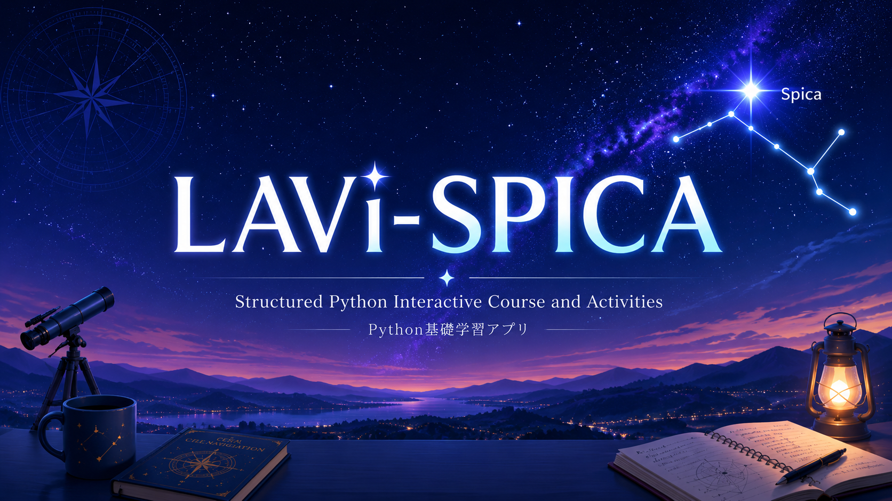

  

# LAVi-SPICA

**LAVi-SPICA** は、プログラミングを初めて学ぶ大学生のためのPython基礎学習アプリです。

**SPICA** は **Structured Python Interactive Course and Activities** の略です。文法を読むだけでなく、**処理を予想する → コードを書く → 実行する → 結果を説明する**という学習を繰り返し、Pythonの考え方と問題を解く力を身につけます。

Pythonはブラウザ内で動くため、端末へのインストールは不要です。授業中の演習、欠席した回の補習、自宅での復習を同じ教材で進められます。

## 講義補助モード

講義補助モードでは、「区分」より細かいlesson ID単位のトピックを選び、**今日のまとめ → 知識確認 → 画面内コード演習と答え合わせ → 最後の確認 → 資料・任意応用例**の順で復習します。選択後のURLには`?topics=01-variables`のように範囲が入り、そのままClassroomへ共有できます。区分番号は授業日や全14回の回数を表しません。

コード問題はすべてpractice IDで共通管理され、学習コース、練習問題、講義補助モードのどこから開いても同じ問題文、開始コード、下書き、ヒント、解答例、採点条件を使います。コードを編集すると現在の判定は「未判定」に戻り、過去の合格履歴とは区別されます。

## 教員向け：資料・トピック・問題を編集する

- 資料本体は[`js/materials.js`](js/materials.js)へ`id`、`title`、`type`、`url`、`access`、`description`を登録します。URLの差し替えはここだけで行います。Colabの`access`は`enrolled`、公開PDFは`public`です。履修者限定ファイルをリポジトリへ複製しないでください。
- [`js/lecture-plan.js`](js/lecture-plan.js)の各`topics`へ既存lesson IDと`materialRefs`を設定します。参照ごとの`coverage`には、その資料で確認する内容を書きます。PDFの節・ページを確認できない場合は推測せず、ファイル全体への参照にします。
- 今日の範囲は講義補助画面のチェックボックスで選び、「選んだ範囲を表示」後に共有URLをコピーします。存在しないIDはエラー表示となり、全問題へ自動転送されません。
- 問題は[`js/content.js`](js/content.js)または[`js/lesson-extensions.js`](js/lesson-extensions.js)へ一意のIDで追加します。`starterCode`、段階的な`hints`、`solution`、`check`、関連lessonを揃えます。採点条件が空なら合格ではなく未判定になります。
- 応用例はトピックの`application`へ、実在する作例名、文法との関係、予想、変更箇所、観察結果、URL、画面内の開き方を設定します。未確認のdeep linkは作らず、外部例を必修条件にしません。

ColabはGoogle Classroomの履修者にGoogle側で共有されます。SPICAは新しい認証を追加せず、一般利用者は公開教材と練習問題を引き続き利用できます。開けない場合もリンク切れや未履修とは断定しません。問題棚卸しは[`docs/EXERCISE-INVENTORY.md`](docs/EXERCISE-INVENTORY.md)を参照してください。

編集後は`npm run check`と`npm test`を実行し、`http://localhost:4173/#lecture`で共有URL、戻る・進む、再読み込み、下書き復元を確認します。

## 学べる内容

| 学習段階 | 主な内容 |
|---|---|
| Pythonの第一歩 | 変数、型、四則演算、`print()`、f-string |
| データをまとめる | `list`、`dict`、`tuple`、index、slice、メソッド |
| 計算を繰り返す | `math`、`range()`、`for`、累積計算 |
| 条件で処理を変える | 比較演算、`if`、`elif`、論理演算、抽出・分類 |
| 処理を再利用する | `def`、引数、`return`、関数分割、デバッグ |
| 科学計算へ進む | オブジェクト、class、NumPy、配列演算 |
| データを読み解く | CSV、欠損値、集計、保存、Matplotlib |

## lessonの進め方

各lessonは、アプリだけでも学び直せるように次の順序で構成されています。

1. **到達目標**で、できるようになることを確認します。
2. **詳しい解説**で、文法の役割、記号の意味、処理順序を読みます。
3. **処理の追跡**で、各行の実行後に変数と出力がどう変わるか確かめます。
4. **入力する例題**を実行し、予想と実際の結果を比べます。
5. **練習問題**で、短いコードを自分で完成させます。
6. **事後学習**の知識問題2問とコード問題2問で、理解を定着させます。
7. **エラー確認**で、よくある失敗と原因の探し方を確認します。

練習問題と事後学習のコード問題は、出力や必要な処理を自動確認できます。ヒントと解答例は、まず自分で試した後に開いてください。

## Pythonエディタ

lesson内のエディタでは、次の内容を確認できます。

- `print()`による出力とエラーメッセージ
- 実行後の主な変数、型、値
- Matplotlibで作成した図
- コードが作成した小さなファイル

エラーが出たときは、tracebackの最後、行番号、変数名、引用符、括弧、コロン、インデントの順に確認します。一度に多くの場所を直さず、1か所ずつ変更して再実行します。

## 学習記録

lessonの完了、コード下書き、予想、事後学習の回答、練習履歴は、使用中のブラウザへ自動保存されます。通常の再読み込みやブラウザ終了では消えません。

ただし、サイトデータを削除した場合、別のブラウザや端末を使った場合、端末を初期化した場合には記録を引き継げません。大切な記録は「進捗・保存」から進捗JSONを書き出してください。書き出したJSONは、別の端末でも読み込めます。

## 授業当日の確認テスト

確認テストは、学生用NUメールと教室内のQR認証を使って受験します。

1. スマートフォンで、教室のスクリーンに表示されたQRコードを読み取ります。
2. 初回だけ学籍番号と氏名を登録します。次回からはNUメールから復元されます。
3. PCで、教員から案内された「PC小テスト入口」を学生用NUメールで開きます。
4. 必要なQR認証が完了し、教員が開始操作をすると問題画面が開きます。
5. 選択・短答問題と短いPythonコード問題へ回答し、画面から提出します。
6. 第2認証が設定された回は、教員の案内に従ってもう一度QRコードを読み取ります。

スマートフォンを忘れた場合やQRを読み取れない場合は、PC待機画面から教員確認を依頼できます。教員が教室内の本人と学籍情報を確認した後、そのGoogleアカウントだけを個別に認証します。共通パスワードは使用しません。

回答はクラウドへ送信されるため、通常は回答JSONをGoogle Classroomへ添付する必要はありません。得点や返却方法は教員の指示に従ってください。

詳しい操作は [学生向けガイド](docs/STUDENT_GUIDE.md) を参照してください。

## 対応環境

最新のGoogle ChromeまたはMicrosoft Edgeを推奨します。FirefoxとSafariでも利用できます。閲覧やQR認証はスマートフォンでも可能ですが、Pythonコードの入力にはキーボードを使えるPCまたはタブレットが適しています。

## License

MIT License
